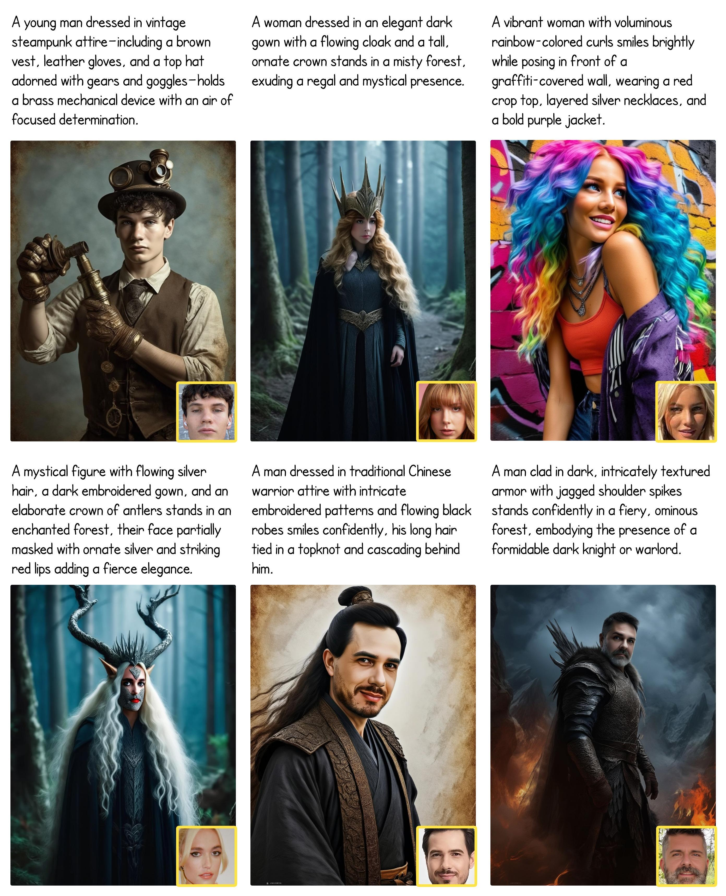

<div align="center">

## FaceCLIP
[**Zichuan Liu**](https://scholar.google.com/citations?user=-H18WY8AAAAJ)&nbsp;&nbsp;&nbsp;&nbsp;
[**Liming Jiang**](https://liming-jiang.com/)&nbsp;&nbsp;&nbsp;&nbsp;
[**Qing Yan**](https://scholar.google.com/citations?user=0TIYjPAAAAAJ)&nbsp;&nbsp;&nbsp;&nbsp;
[**Yumin Jia**](https://www.linkedin.com/in/yuminjia/)&nbsp;&nbsp;&nbsp;&nbsp;
[**Hao Kang**](https://scholar.google.com/citations?user=VeTCSyEAAAAJ)&nbsp;&nbsp;&nbsp;&nbsp;
[**Xin Lu**](https://scholar.google.com/citations?user=mFC0wp8AAAAJ)<br />
ByteDance Intelligent Creation<br />

<a href="https://github.com/bytedance/FaceCLIP"></a> &ensp;
<a href="https://arxiv.org/abs/2504.14202"></a> &ensp;
<a href="https://huggingface.co/ByteDance/FaceCLIP"></a> &ensp;

</div>

> **Abstract:** *Recent progress in text-to-image (T2I) diffusion models has greatly improved image quality and flexibility. However, a major challenge in personalized generation remains: preserving the subject’s identity (ID) while allowing diverse visual changes. We address this with a new framework for ID-preserving image generation. Instead of relying on adapter modules to inject identity features into pre-trained models, we propose a unified multi-modal encoding strategy that jointly captures identity and text information. Our method, called FaceCLIP, learns a shared embedding space for facial identity and textual semantics. Given a reference face image and a text prompt, FaceCLIP produces a joint representation that guides the generative model to synthesize images consistent with both the subject’s identity and the prompt. To train FaceCLIP, we introduce a multi-modal alignment loss that aligns features across face, text, and image domains. We then integrate FaceCLIP with existing UNet and Diffusion Transformer (DiT) architectures, forming a complete synthesis pipeline FaceCLIP-x. Compared to existing ID-preserving approaches, our method produces more photorealistic portraits with better identity retention and text alignment. Extensive experiments demonstrate that FaceCLIP-x outperforms prior methods in both qualitative and quantitative evaluations.*





## Model Zoo

|    Version    |                                Description                                |  
|:-------------:|:-------------------------------------------------------------------------:|
| FaceCLIP-SDXL | SDXL base model trained with FaceCLIP-L-14 and FaceCLIP-bigG-14 encoders. |
|  FaceT5-FLUX  |            FLUX.1-dev base model trained with FaceT5 encoder.             |

## Requirements and Installation

### Install other dependencies
```bash
bash setup.bash
```

## Inference

### Local Inference Script

FaceCLIP-SDXL inference
```bash
python3 infer_face_clip_sdxl.py
```

FaceT5-FLUX inference
```bash
python3 infer_face_t5_flux.py
```


## 📜 Disclaimer and Licenses

The images used in this repository and related demos are sourced from consented subjects or generated by the models. These pictures are intended solely to showcase the capabilities of our research. If you have any concerns, please feel free to contact us, and we will promptly remove any inappropriate content.

The use of the released code, model, and demo must strictly adhere to the respective licenses. Our code is released under the [Apache License 2.0](./LICENSE), and our model is released under the [Creative Commons Attribution-NonCommercial 4.0 International Public License](https://huggingface.co/ByteDance/FaceCLIP/blob/main/LICENSE) for academic research purposes only. Any manual or automatic downloading of the face models from [InsightFace](https://github.com/deepinsight/insightface), the [FLUX.1-dev](https://huggingface.co/black-forest-labs/FLUX.1-dev) base model, LoRAs ([Realism](https://civitai.com/models/631986?modelVersionId=706528) and [Anti-blur](https://civitai.com/models/675581/anti-blur-flux-lora)), *etc.*, must follow their original licenses and be used only for academic research purposes.

This research aims to positively impact the field of Generative AI. Any usage of this method must be responsible and comply with local laws. The developers do not assume any responsibility for any potential misuse.

## 🤗 Acknowledgments

We would like to express our gratitude to the authors of the following repositories, from which we referenced code, model or assets:
<br />https://huggingface.co/black-forest-labs/FLUX.1-dev
<br />https://github.com/huggingface/diffusers
<br />https://huggingface.co/stabilityai/stable-diffusion-xl-base-1.0

## 📖 Citation

If you find FaceCLIP useful for your research or applications, please cite our paper:

```bibtex
@article{liu2025learning,
  title={Learning Joint ID-Textual Representation for ID-Preserving Image Synthesis},
  author={Liu, Zichuan and Jiang, Liming and Yan, Qing and Jia, Yumin and Kang, Hao and Lu, Xin},
  journal={arXiv preprint arXiv:2504.14202},
  year={2025}
}
```